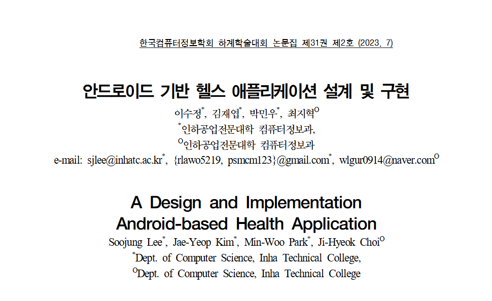
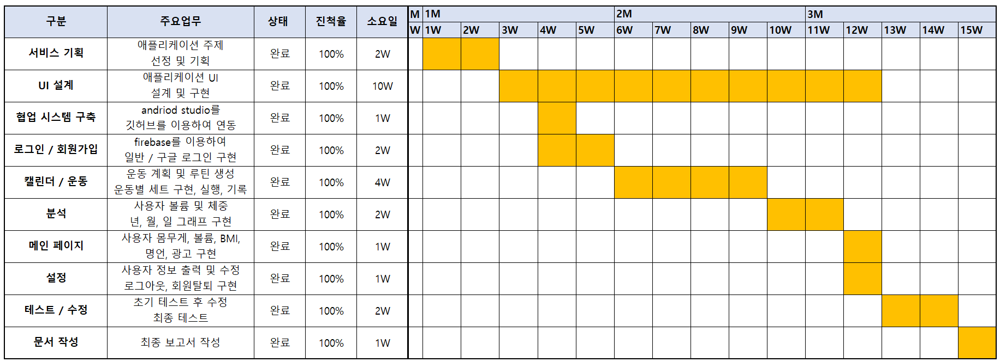
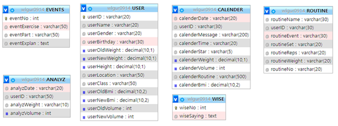
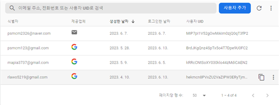
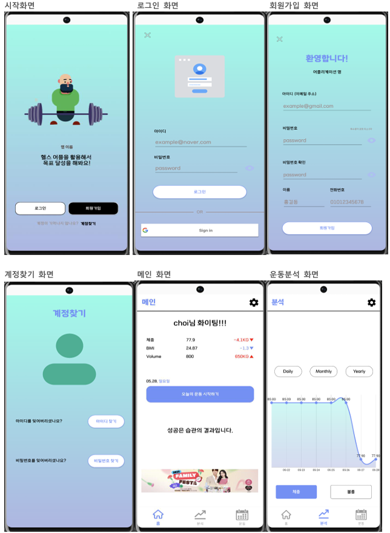

  

 

# 💪 GYMPT Fitness Application

> 헬스 인구 증가에 따라 운동 계획 수립, 기록, 신체 변화 추적을 편리하게 제공하는 **헬스케어 앱**을 설계하고 구현한 프로젝트입니다.  
> 본 애플리케이션은 **운동 루틴 관리, 운동 기록 저장, 체중 및 중량 변화 분석**을 통해 사용자들의 운동 편의성과 동기부여를 강화하는 것을 목표로 합니다.  

 

## 📖 프로젝트 개요
- **주제 선정 이유**: 헬스 인구 증가와 함께 운동 기록 및 분석의 필요성 증가  
- **목표**: 운동 일정/루틴 관리, 기록 및 분석을 통해 사용자 맞춤형 피트니스 지원  
- **환경**: Android Studio, MySQL, Firebase, PHP Myadmin, FTP 서버  

 

## 👥 팀 구성 및 역할
- **김재엽**: 프로젝트 기획, FireBase 연동, Google 연동, 백엔드 구현  
- **박민우**: UI/UX 디자인, 프런트엔드 구현, 로고 디자인, 벤치마킹  
- **최지혁**: 데이터베이스 설계, DB 서버 연동, 운동 데이터 조사, 백엔드 구현  

 
## 📊 간트차트

 

  

 

## 🗄️ DB구조

 

**MySQL DB 구조**

  

 

**FireBase DB 구조**

  

 

## ⚙️ 주요 기능
- **회원가입/로그인**: Firebase 기반 계정 생성 및 인증  
- **운동 루틴 관리**: 운동 일정, 세트, 볼륨 입력 및 저장  
- **운동 기록**: 일별 기록 저장 및 달력 기반 조회  
- **체중/중량 분석**: 그래프 기반 변화 추이 시각화  
- **운동 보조**: 세트 타이머 및 휴식 알림 기능  
- **설정**: 사용자 정보 변경 및 회원 탈퇴 가능  

 

  

 

## 📝 배운 점
- Volley 라이브러리의 비동기 문제 해결을 통해 데이터 순서 보장 구현  
- MVC 구조 및 서버-DB 연동 경험 강화  
- Firebase와 MySQL을 병행하여 유저 인증 및 데이터 관리 설계  
- 헬스케어 애플리케이션 설계 시 **사용자 경험(UI/UX)**의 중요성 체감  

 

## 🛠️ 사용 기술 (Tech Stack)
- **Frontend**: Android (Java), XML 기반 UI, Bootstrap 아이콘  
- **Backend**: PHP, Firebase Authentication, Firebase Realtime Database  
- **Database**: MySQL, Firebase (혼합 구조)  
- **Infra**: FTP 서버, Firebase Hosting  
- **Library/Tool**: Volley (비동기 통신), MPAndroidChart (그래프), GitHub, Figma  

 

## 📎 참고 자료
해당 README는 요약본이며, 자세한 설계 문서 및 이미지 자료는 아래 첨부 문서에서 확인 가능합니다.

- 📄 [GYMPT_최종보고서.pdf.docx](./GYMPT_최종보고서.pdf)  

